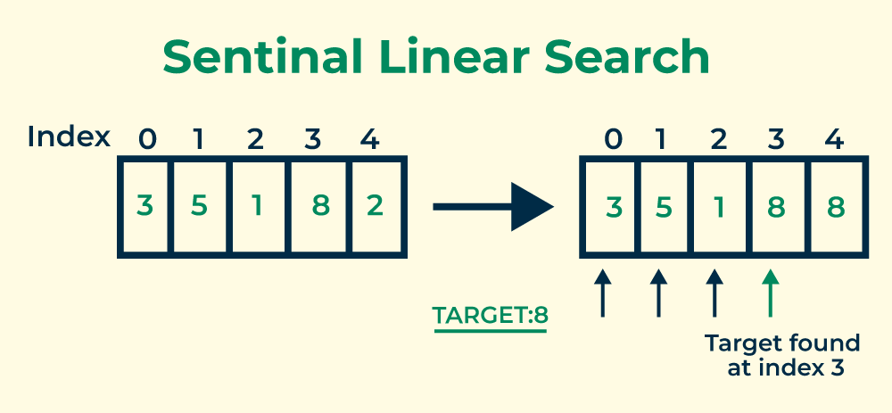

# Searching Algorithm Analysis

## Sentinal Linear Search

Pada kesempatan kali ini kami akan menganalisis kompleksitas algoritma dari algoritma Sentinel Linear Search

Sentinal Linear Search adalah variasi dari algoritma Traditional Linear Search yang digunakan untuk menemukan nilai target dalam array atau list. Ide dasar di balik algoritma ini adalah menambahkan nilai sentinel di akhir array yang sama dengan nilai target yang kita cari. Hal ini membantu menghindari pemeriksaan kondisi batas array selama setiap iterasi perulangan, karena nilai sentinel bertindak sebagai penghenti perulangan.

Meskipun dalam kasus terburuk kompleksitas waktu kedua algoritma adalah O(n). Hanya jumlah perbandingan yang lebih sedikit pada pencarian linier sentinel dibandingkan pencarian linier



Berikut merupakan analisis dari **Sentinal Linear Search**

```bash
def sentinelLinearSearch(array, key):            //2
    last = array[len(array) - 1][0]              //3
    array[len(array) - 1][0] = key               //3
    i = 0                                        //1
    while array[i][0] != key:                    //n
        i += 1                                   //2n
    array[len(array) - 1][0] = last              //3
    if i < len(array) - 1 or last == key:        //5
        return i                                 //1
    else:
        return -1
```

Dari perhitunga tersebut didapatkan:

````bash
```bash
T(n)    = 2+3+3+1+n+2n+3+5+1
        = 3n+18
O(n)
````
